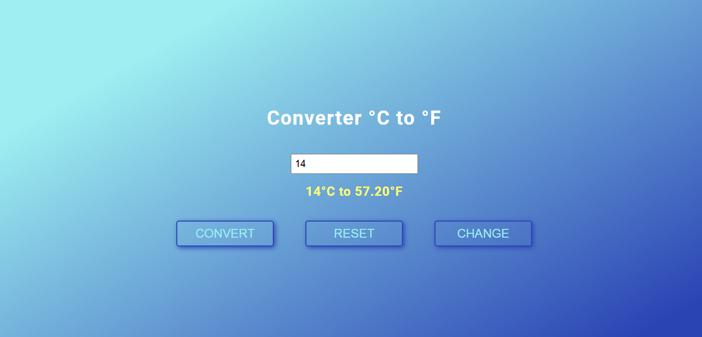

<div align="center">

# 🌡️ Celsius ↔ Fahrenheit Converter
### Convert temperatures easily between Celsius and Fahrenheit

<!-- Preview Image -->


<br/><br/>


</div>

---

## 📌 About The Project

This project is a **JavaScript-based temperature converter** that allows users to  
**convert temperatures between Celsius and Fahrenheit** easily.  

It focuses on:
- DOM manipulation
- JavaScript functions and events
- User input handling
- Simple, interactive UI

---

## ✨ Features

- 🌡 Convert Celsius to Fahrenheit
- ❄️ Convert Fahrenheit to Celsius
- 🔄 Instant conversion on input
- 📱 Fully responsive layout
- 🚫 Vanilla JavaScript, no frameworks

---

## 🛠 Tech Stack

| Technology | Purpose |
|------------|--------|
| HTML5 | Structure & inputs |
| CSS3 | Styling & layout |
| JavaScript (ES6+) | Conversion logic & DOM handling |
| Git & GitHub | Version control |

---

## 📂 Project Structure

```bash
├─ img
│  └─ thermometer.png
├─ index.html
├─ js
│  └─ script.js
├─ LICENSE
├─ README.md
└─ style
   └─ style.css
 